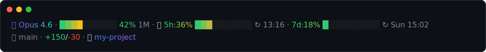
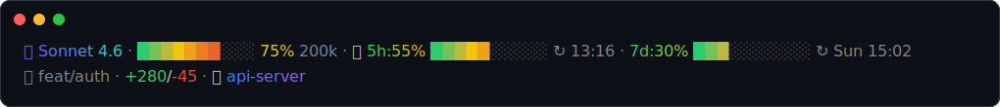
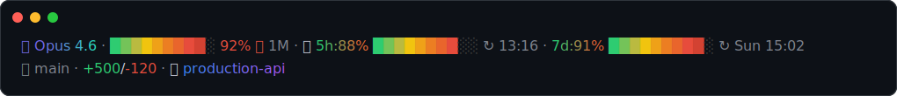
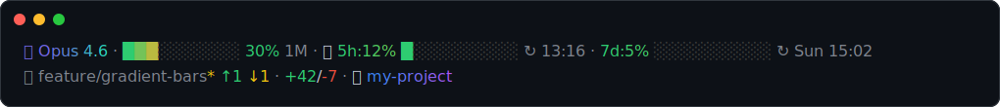
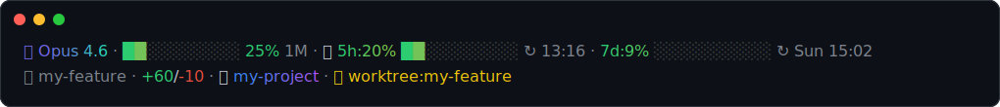
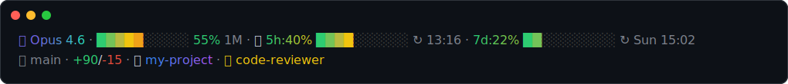
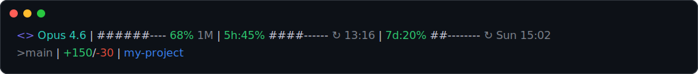

# claude-status-line

A gradient, emoji-accented status line for [Claude Code](https://docs.anthropic.com/en/docs/claude-code) — with first-class **Windows** support.

This is a Windows-compatible fork of [kcchien/claude-code-statusline](https://github.com/kcchien/claude-code-statusline), rebuilt and extended for git-bash / Windows Terminal, with a heavier focus on gradient rendering, rate-limit visibility, and git status.

## What it looks like



- Model name and directory path render as smooth per-character truecolor gradients.
- Context-window usage bar: green → yellow → orange → red, 10 blocks.
- 5h / 7d rate-limit usage: same gradient bar style, label + value gradient text.
- Git branch, dirty flag (`*`), ahead/behind vs. upstream (`↑`/`↓`).
- Lines added/removed, current directory, active subagent/worktree indicator.
- Degrades cleanly: truecolor → ANSI 256 → plain ASCII, and Nerd Font / emoji / plain-Unicode icon sets.

### All states

**Warning** (75% context)


**Danger** (92% context, high rate limits)


**Dirty branch, ahead/behind upstream**


**Active worktree**


**Active subagent**


**ASCII fallback** (`CLAUDE_STATUSLINE_ASCII=1`)


These are real, exact renders — not screenshots. `tools/render_svg.py` parses the actual ANSI/truecolor escape codes `statusline.sh` outputs and draws them as SVG text, so every image is pixel-accurate to what the script really produces and stays cheap to regenerate:

```bash
./tools/generate-showcase.sh
```

This re-runs the script against a set of hardcoded mock JSON payloads (see the file for all of them — normal/warning/danger/dirty-branch/worktree/agent/ASCII) and writes fresh SVGs to `docs/images/`. Add a new mock state to that script whenever a new visual feature needs a showcase image — no terminal, screenshot tool, or manual cropping required.

(`tools/render_svg.py` needs Python 3, stdlib only — no packages to install. Only used for regenerating these images; not a runtime dependency of the status line itself.)

## Why this fork exists

The original script assumes a macOS/Linux bash + native `jq`. On Windows (git-bash), four things break silently:

1. **No `jq`** — the script has a hard `command -v jq` gate and just goes blank without it.
2. **CRLF corruption** — native Windows `jq.exe` writes CRLF line endings (text-mode stdio). git-bash reads that raw, and the stray `\r` breaks every numeric field's arithmetic.
3. **Backslash paths** — `workspace.current_dir` on Windows uses `\`, not `/`. The original `split("/")` never finds a separator, so the *entire path* leaks into the display — and because it contains literal backslashes, `printf '%b'` later misinterprets them as escape sequences (`\U`, `\0nn`, ...), corrupting the rest of the line.
4. **`stat` flag mismatch** — the git-status cache reads the cache file's mtime with BSD `stat -f %m` (macOS). git-bash ships GNU coreutils, which uses `stat -c %Y` instead; the BSD form silently fails there. Harmless in effect (the cache just always misses and re-runs git, not a correctness bug), but worth fixing since it defeats the whole point of caching.

This fork fixes all four, plus adds the gradient/rate-limit/git features above.

## Requirements

- Claude Code
- A bash-compatible shell — on Windows this means **Git for Windows** (git-bash), which you almost certainly already have if you use `git`.
- `jq` — the installer fetches a static binary for you if missing.
- A truecolor-capable terminal for the full gradient experience (Windows Terminal, VS Code's integrated terminal, iTerm2, most modern Linux terminals). Falls back gracefully otherwise.

## Install

```bash
git clone https://github.com/azekyoo/claude-status-line.git
cd claude-status-line
./install.sh
```

This copies `statusline.sh` to `~/.claude/statusline/claude-code-statusline.sh`, and — on Windows only — downloads a static `jq.exe` to `~/bin/jq.exe` if `jq` isn't already on your PATH (the script auto-detects it there even without a PATH change).

### Wire it into Claude Code

Add this to `~/.claude/settings.json`:

**Windows:**
```json
{
  "statusLine": {
    "type": "command",
    "command": "\"C:\\Program Files\\Git\\bin\\bash.exe\" \"C:\\Users\\YOURNAME\\.claude\\statusline\\claude-code-statusline.sh\"",
    "timeout": 10
  }
}
```
Replace `YOURNAME` with your Windows username. This invokes git-bash directly with a full path, since Claude Code runs the `command` string outside of any interactive shell profile (so PATH additions from `.bashrc` won't apply).

**macOS / Linux:**
```json
{
  "statusLine": {
    "type": "command",
    "command": "~/.claude/statusline/claude-code-statusline.sh",
    "timeout": 10
  }
}
```

Restart Claude Code. The status line appears after your next message.

### Reverting

If you don't like it, just restore your previous `statusLine.command` value in `settings.json` (or delete the `statusLine` key entirely to go back to Claude Code's default). Nothing else on your system is touched — `~/bin/jq.exe`, if installed, is harmless to leave in place or delete.

## Configuration

All via environment variables (set them in `~/.bashrc`, or `env` in `settings.json` if you want them applied specifically for Claude Code):

| Variable | Default | Effect |
|---|---|---|
| `CLAUDE_STATUSLINE_ASCII` | `0` | `1` = plain ASCII only, no Unicode/emoji/truecolor |
| `CLAUDE_STATUSLINE_NERDFONT` | `0` | `1` = use Nerd Font icons instead of emoji (requires a Nerd Font set in your terminal) |
| `CLAUDE_STATUSLINE_EMOJI` | `1` | `0` = disable emoji, fall back to plain Unicode symbols (`◆`, `⎇`, `⚠`) |
| `CLAUDE_STATUSLINE_POWERLINE` | follows `NERDFONT` | `1` = Powerline-arrow separators |
| `CLAUDE_STATUSLINE_JQ` | auto-detect | explicit path to a `jq` binary |
| `COLORTERM` | (terminal-set) | `truecolor` / `24bit` enables the gradient bars/text; also auto-enabled under Windows Terminal via `WT_SESSION` |

## Notes

- Cost (`$`) is parsed from the JSON payload but intentionally not displayed — on a Claude subscription plan it's a notional API-equivalent estimate, not a real charge, and was more confusing than useful.
- Elapsed session time is likewise parsed but not shown, by request — feel free to re-enable by reading `duration_ms` and building a `Xm Ys` string if you want it back.
- Git branch/dirty/ahead-behind status is cached for 5 seconds (`/tmp/claude-statusline-git-cache`) to keep the status line fast on large repos.

## License

MIT — see [LICENSE](LICENSE). Original work Copyright (c) 2026 KC Chien ([kcchien/claude-code-statusline](https://github.com/kcchien/claude-code-statusline)).
